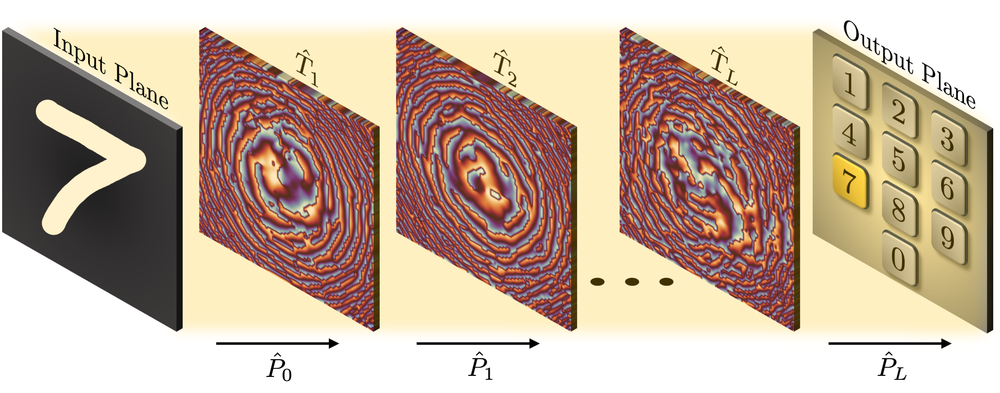

# Diffractive Optical Neural Networks with Coherence

> PyTorch implementation of diffractive optical neural networks under arbitrary spatial coherence.

<p align="center">
  
</p>

Supplementary code from our [paper](https://arxiv.org/abs/2310.03679).

## Usage
Run the following to train a model on the MNIST dataset:
```bash
python train.py --coherence-degree=1 --wavelength=700e-9 --pixel-size=10e-6
```
